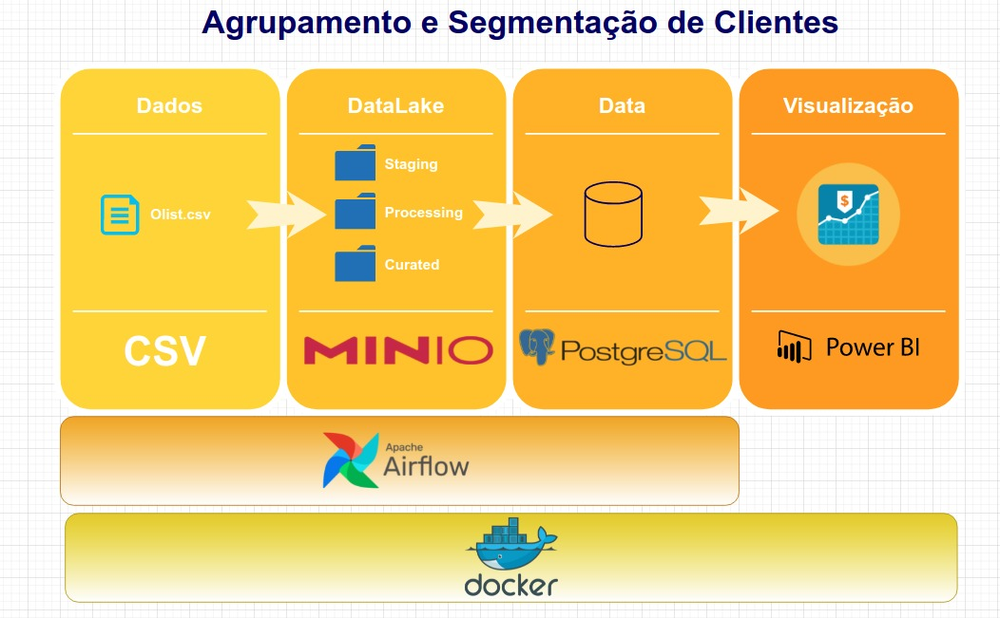

# Descrição das funções do projeto:

### Funções:
- Gestor do projeto - Fabio
- Analista do projeto - Ramon
- Cientistas do projeto - Ricardo e Thiago
- Engenheiro do projeto - Marcos

### Etapas do projeto (6 de janeiro):
#### 1. Documentação:



  Marcos e Ricardo
  - Organização da documentação
  - Arquitetura
  - Criação de constainers para infraestrutura com docker


#### 2. Criação de containers para infraestrutura (6 de janeiro):
  Marcos e Ramon
  - Docker, MinIO e AirFlow


```
docker run -d -p 9000:9000 -p 9001:9001 -e "MINIO_ACCESS_KEY=admin" -e "MINIO_SECRET_KEY=svm" -v "/Dados/Docker/minio:/data" -name minio minio/minio server /data --console-address ":9001"
```
```
docker run -d -p 8080:8080 -v "/Dados/Docker/airflow/dags:/opt/airflow/dags/" --entrypoint=/bin/bash --name airflow apache/airflow:2.1.1-python3.8 -c '(airflow db init && airflow users create --username admin --password svm --firstname Banco --lastname Lastname --role Admin --email marcos.goval@gmail.com); airflow webserver & airflow scheduler'
```
*A definir*

#### 3. Processamento e limpeza dos dados (9 de janeiro):
  Fabio e Thiago
  - Data Cleaning
  - Seleção de Colunas -> relevância, junções, remoção
  - Tranformar dados -> tipos, missing values e distribuição.

#### 4. Análise exploratória de dados (9 de janeiro):
  Ricardo e Fabio
  - Descatar insights e padrões descobertos
  - Documentar toda a análise de dados

#### 5. Modelagem e pré-processamento de dados (13 de janeiro):
  Ricardo e Thiago
  - Feature selection
  - Preprocessamento
  - Performance do modelo
  - Persistir melhor modelo em Data Lake

#### 6. DAGs e Pipeline (16 de janeiro):
  Marcos e Ramon
  - Criação de etapas e automação de processos no ApacheAirFlow

#### 7. Criação de Dashboard (19 de janeiro):
  Fabio e Ramon
  - Exposição do modelo com Power BI (Em análise)
