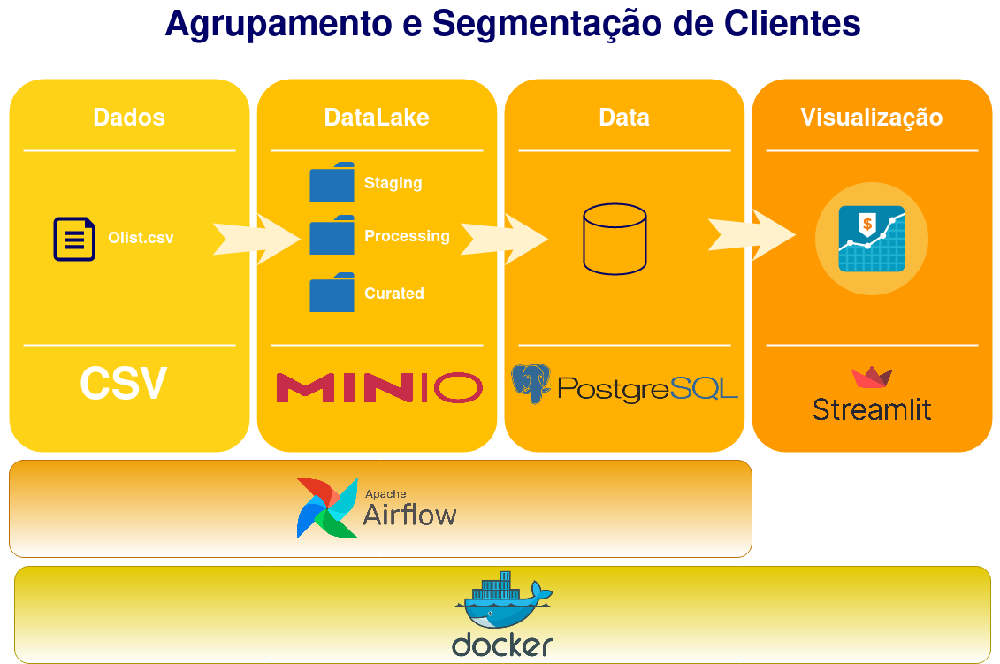

# SVM_Squad
## Name
Grupo - SVM_Squad

## Description
Projeto de agrupamento (clustering) do dataset público da [olist](https://www.kaggle.com/olistbr/brazilian-ecommerce), proposta criada pela Stack Labs (grupo de produção) da [Stack Academy](https://www.linkedin.com/company/stack-tecnologias/) (antiga [Minerando dados](https://minerandodados.com.br/))

## Estrutura visual do projeto:


## Funções:
Gestor do projeto - Fabio
Analista do projeto - Ramon
Cientistas do projeto - Ricardo e Thiago
Engenheiro do projeto - Marcos

#### 1. Documentação:
Responsáveis:  Marcos e Ricardo
  - Organização da documentação
  - Arquitetura
  - Criação de constainers para infraestrutura com docker


#### 2. Criação de containers para infraestrutura:
  Marcos e Ramon
  - Docker, MinIO e AirFlow


```
docker run -d -p 9000:9000 -p 9001:9001 -e "MINIO_ACCESS_KEY=admin" -e "MINIO_SECRET_KEY=svmSQUAD" -v "./minio:/data" -name minio minio/minio server /data --console-address ":9001"
```
```
docker run -d -p 8080:8080 -v "./Dags:/opt/airflow/dags/" --entrypoint=/bin/bash --name airflow apache/airflow:2.1.1-python3.8 -c '(airflow db init && airflow users create --username admin --password svm --firstname Base --lastname Dados --role Admin --email SeuEmailAqui@gmail.com); airflow webserver & airflow scheduler'
```

#### 3. Processamento e limpeza dos dados:
  Fabio e Thiago
  - Data Cleaning
  - Seleção de Colunas -> relevância, junções, remoção
  - Tranformar dados -> tipos, missing values e distribuição.

#### 4. Análise exploratória de dados:
  Ricardo e Fabio
  - Descatar insights e padrões descobertos
  - Documentar toda a análise de dados

#### 5. Modelagem e pré-processamento de dados:
  Ricardo e Thiago
  - Feature selection
  - Preprocessamento
  - Performance do modelo
  - Persistir melhor modelo em Data Lake

#### 6. DAGs e Pipeline:
  Marcos e Ramon
  - Criação de etapas e automação de processos no ApacheAirFlow

#### 7. Criação de Dashboard:
  Fabio e Ramon
  - Exposição do modelo com streamlit ou Power BI

## Status do projeto:
- Faltando ajustar banco de dados 
- Ajustar threshold do modelo
- Finalizar deploy da solução
